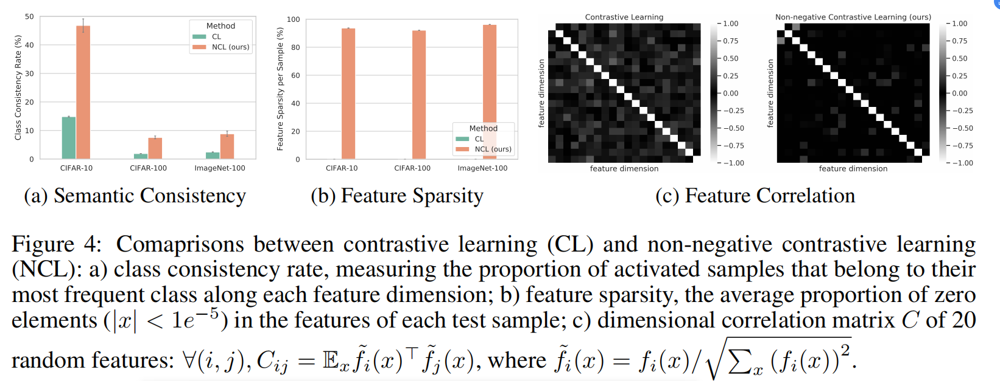

# Non-negative Contrastive Learning


This repository includes a PyTorch implementation of the ICLR 2024 paper [Non-negative Contrastive Learning](https://arxiv.org/pdf/2403.12459), authored by  [Yifei Wang*](https://yifeiwang77.com/), Qi Zhang*, Yaoyu Guo, and [Yisen Wang](https://yisenwang.github.io/).


Non-negative Contrastive Learning (NCL) is a new self-supervised learning method that imposes non-negativity on contrastive features. NCL can significantly enhance the feature interpretability, sparsity, and disentanglement over standard contrastive learning, while improving (at least maintaining) its performance on classical tasks.





## TLDR

We implement NCL upon the ```solo-learn``` [repo](https://github.com/vturrisi/solo-learn) (the version on Sep 27, 2022), which enables a standardized and modularized protocol for various SSL methods.

What we have changed is minimal. Apart from the parser nuances, we essentially only change [one line](https://github.com/PKU-ML/non_neg/blob/main/solo/methods/simclr.py#L174):

```
    z = torch.nn.functional.relu(z)
```
That is, if we use NCL, we pass the flag ```self.non_neg=relu```, which applies ReLU to the projector output ```z```.

This is all we need to convert a standard contrastive method (e.g., SimCLR) to a non-negative version, and deliver all the magic.


## Installation

The installation follows ```solo-learn```.  First clone the repo in a ``Python 3.8`` environment. Then install dependence with
```
pip3 install .[dali,umap,h5] --extra-index-url https://developer.download.nvidia.com/compute/redist --extra-index-url https://download.pytorch.org/whl/cu113
```

## Pretraining

Pretrain with the default configuration files using the following command:
```bash
python3 main_pretrain.py --config-path scripts/pretrain/{dataset}/ --config-name {method}.yaml
```

Here, ``dataset={cifar, imagenet-100}`` and ``method={simclr, ncl}``. To config either ``cifar10`` or ``cifar100``, change or override the ``data.dataset`` property to either ``cifar10`` or ``cifar100``.

**Configurations.** The training and evaluation configuration files are in the ``scripts`` folder. Specifically, one can change arguments in the yaml files to realize different methods. Otherwise, one may also override arguments directly in the command line, e.g.,
```bash
python3 main_pretrain.py --config-path scripts/pretrain/{dataset}/ --config-name {method}.yaml dataset=cifar100 non_neg=rep_relu
```

Notably, we use ``non_neg=rep_relu`` for CIFAR-10 and CIFAR-100 and ``non_neg=relu`` for ImageNet-100 by default.


## Downstream Evaluation


After that, for linear evaluation, run the following command:


```bash
python3 main_linear.py \
    --config-path scripts/linear/cifar(imagenet-100) \
    --config-name simclr.yaml

```

And for fine-tuning evaluation, run the following command:


```bash
python3 main_linear.py \
    --config-path scripts/finetuning/cifar(imagenet-100) \
    --config-name simclr.yaml

```

In the scripts of offline evaluations, we use the argument ``pretrained_feature_extractor`` to configure the path of the pretrained checkpoints.

And for offline linear probing with selected dimensions, run the following command:

```bash
python3 main_linear.py \
    --config-path scripts/selected \
    --config-name simclr.yaml

```

where the argument ``selected_dims`` configures the dimensions of selected features.


## Loading Pretrained Checkpoints

The following table provides the pre-trained checkpoints for CL and NCL.

<table><tbody>
<!-- START TABLE -->
<!-- TABLE HEADER -->
<th valign="bottom"></th>
<th valign="bottom">CIFAR-10</th>
<th valign="bottom">CIFAR-100</th>
<th valign="bottom">ImageNet-100</th>
<!-- TABLE BODY -->
<tr><td align="left">checkpoints</td>
<td align="center"><a href="https://drive.google.com/drive/folders/1z57D9WOZk5N5nsqVixkUza9ZX6NiH6Wx?usp=sharing">download</a></td>
<td align="center"><a href="https://drive.google.com/drive/folders/1EbF9oKFu9rjsfRj_hv-Q-GVYKUSVxIkP?usp=sharing">download</a></td>
<td align="center"><a href="https://drive.google.com/drive/folders/1iIqn2hklptrlG3bLmjULw_rfKKO-JC5s?usp=sharing">download</a></td>
</tr>
</tbody></table>


## Citing this work
If you find the work useful, please cite the accompanying paper:
```
@inproceedings{
wang2024nonnegative,
title={Non-negative Contrastive Learning},
author={Yifei Wang and Qi Zhang and Yaoyu Guo and Yisen Wang},
booktitle={ICLR},
year={2024},
}
```

## Acknowledgement

Our codes borrow the implementations of SimCLR in the solo-learn repository: https://github.com/vturrisi/solo-learn
