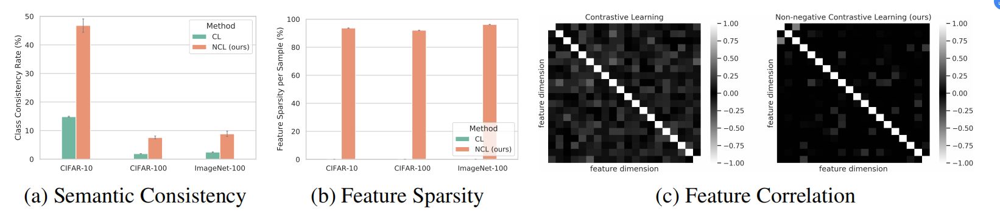

# Non-negative Contrastive Learning

Official PyTorch implementation of the ICLR 2024 paper [Non-negative Contrastive Learning](https://arxiv.org/pdf/2403.12459) by  [Yifei Wang*](https://yifeiwang77.com/), Qi Zhang*, Yaoyu Guo, and [Yisen Wang](https://yisenwang.github.io/).

Links: [Wandb Logs](https://wandb.ai/doxawang/non_neg) | [Checkpoints](https://github.com/PKU-ML/non_neg#pretrained-checkpoints)


**Updates**:

- 2024.04.01. Add [logging of feature stats](https://github.com/PKU-ML/non_neg/blob/main/solo/methods/simclr.py) & [wandb pretraining logs](https://wandb.ai/doxawang/non_neg). With these stats, we can directly observe the differences between CL and NCL training.
- 2024.03.19. Code is released. 🎉

## TLDR

With non-negative constraints  on contrastive features, NCL can significantly enhance feature interpretability, sparsity, and disentanglement over standard contrastive learning, while improving (at least maintaining) its performance on classical tasks.




<!-- Non-negative Contrastive Learning (NCL) is a renaisense  new self-supervised learning method that -->

For implementation, the difference between Contrastive Learning (CL) and Non-negative Contrastive learning (NCL) is minimal. Apart from argparser nuances, NCL only adds [one line](https://github.com/PKU-ML/non_neg/blob/main/solo/methods/simclr.py#L154) upon existing methods:
```
    z = torch.nn.functional.relu(z)
```
which applies a non-negative transformation (eg ReLU) to the output features ```z``` to enforce feature non-negativity. This is all we need to convert a standard CL method (e.g., SimCLR) to a non-negative version, and deliver all the magic.


## Installation

The codebase is built upon a previous version of [```solo-learn```](https://github.com/vturrisi/solo-learn) (the version on Sep 27, 2022). To avoid unexpected errors, first create a ``Python3.8`` environment, and then install the reposoity as below.
```
# clone the repository
git clone https://github.com/PKU-ML/non_neg
# create environment
conda create -n non_neg python=3.8
conda activate non_neg
# install dependences
cd non_neg
pip3 install .[dali,umap,h5] --extra-index-url https://developer.download.nvidia.com/compute/redist --extra-index-url https://download.pytorch.org/whl/cu113
```

## Pretraining

Pretrain with the default configuration files using the following command.

### CIFAR-100 / CIFAR-10
```bash
# SimCLR
python3 main_pretrain.py \
    --config-path scripts/pretrain/cifar \
    --config-name simclr.yaml
# NCL
python3 main_pretrain.py \
    --config-path scripts/pretrain/cifar \
    --config-name ncl.yaml
```
<!-- Here, ``dataset={cifar, imagenet-100}`` and ``method={simclr, ncl}``. To config either ``cifar10`` or ``cifar100``, change or override the ``data.dataset`` property to either ``cifar10`` or ``cifar100``. -->
The default setting is for CIFAR-100. For CIFAR-10, override ``data.dataset=cifar10``. Meanwhile, change the experiment name accordingly to avoid collision, e.g., ``name=simclr-resnet18-cifar10-ncl``. Other experiments follow the same setting.

### ImageNet-100
```bash
# SimCLR
python3 main_pretrain.py \
    --config-path scripts/pretrain/imagenet-100 \
    --config-name simclr.yaml
# NCL
python3 main_pretrain.py \
    --config-path scripts/pretrain/imagenet-100 \
    --config-name ncl.yaml
```

By default, we use ``non_neg=rep_relu`` for CIFAR-10 and CIFAR-100 and ``non_neg=relu`` for ImageNet-100.


## Linear Evaluation


After that, for linear evaluation, run the following command:

```bash
python3 main_linear.py \
    --config-path scripts/linear/{dataset} \
    --config-name simclr.yaml \
    pretrained_feature_extractor=path/to/pretrained/feature/extractor
```
Here ``dataset={cifar,imagenet100}``. We use the argument ``pretrained_feature_extractor`` to configure the path of the pretrained checkpoints.


## Full finetuning

And for fine-tuning evaluation, run the following command:


```bash
python3 main_linear.py \
    --config-path scripts/finetuning/{dataset} \
    --config-name simclr.yaml
```

## Feature Selection

And for offline linear probing with selected dimensions, run the following command:

```bash
python3 main_linear.py \
    --config-path scripts/selected \
    --config-name simclr.yaml \
    selected_dims=256
```
where the argument ``selected_dims`` configures the dimensions of selected features.


## Pretrained Checkpoints

The following table provides the pre-trained checkpoints for CL and NCL.

<table><tbody>
<!-- START TABLE -->
<!-- TABLE HEADER -->
<th valign="bottom"></th>
<th valign="bottom">CIFAR-10</th>
<th valign="bottom">CIFAR-100</th>
<th valign="bottom">ImageNet-100</th>
<!-- TABLE BODY -->
<tr><td align="left">checkpoints</td>
<td align="center"><a href="https://drive.google.com/drive/folders/1z57D9WOZk5N5nsqVixkUza9ZX6NiH6Wx?usp=sharing">download</a></td>
<td align="center"><a href="https://drive.google.com/drive/folders/1EbF9oKFu9rjsfRj_hv-Q-GVYKUSVxIkP?usp=sharing">download</a></td>
<td align="center"><a href="https://drive.google.com/drive/folders/1iIqn2hklptrlG3bLmjULw_rfKKO-JC5s?usp=sharing">download</a></td>
</tr>
</tbody></table>


## Citing this work
If you find the work useful, please cite the accompanying paper:
```
@inproceedings{
wang2024nonnegative,
title={Non-negative Contrastive Learning},
author={Yifei Wang and Qi Zhang and Yaoyu Guo and Yisen Wang},
booktitle={ICLR},
year={2024},
}
```

## Acknowledgement

Our codes borrow the implementations of SimCLR in the solo-learn repository: https://github.com/vturrisi/solo-learn
